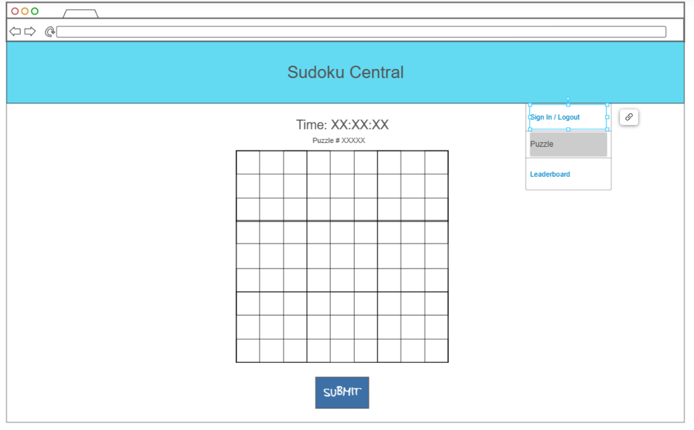
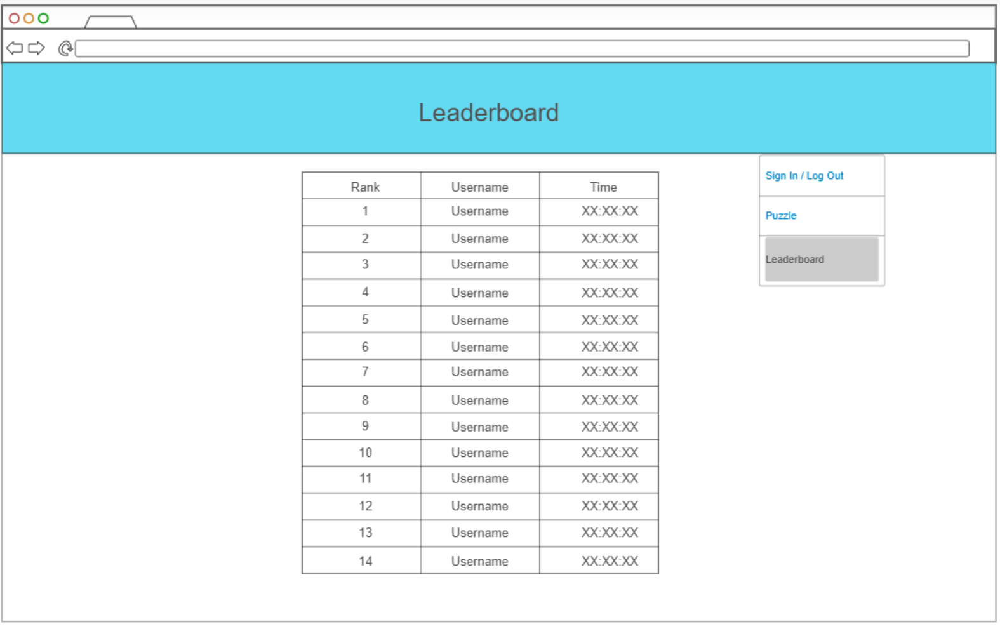

# Sudoku Central

[My Notes](notes.md)

Sudoku Central is an online platform for enjoying a daily randomized game of sudoku, and allows users to see the rankings for the current days' game of sudoku. This will be an easy game of Sudoku


<!-- > [!NOTE]
>  You must modify this `README.md` file for each phase of your development. You only need to fill in the section for each deliverable when that deliverable is submitted in Canvas. Feel free to add additional information to each deliverable description, but make sure you at least have the list of rubric items and a description of what you did for each item. -->

## 🚀 Specification Deliverable

For this deliverable I designed the central idea of the product, and made an example template of what the final product should look like. I checked the box `[x]` and added a description for things I completed.

- [x] Proper use of Markdown - I edited the provided markdown document and made it look presentable, including commenting out the portions that are not applicable yet
- [x] A concise and compelling elevator pitch - done in one moderate-sized paragraph
- [x] Description of key features - summary of currently-planned features (mainly gameplay related) that would appeal to sudoku lovers
- [x] Description of how you will use each technology - summarized the purpose of each technology in the final webpage design of the sudoku project
- [x] One or more rough sketches of your application. Images must be embedded in this file using Markdown image references. - Done - two images designed by me for two of the pages of the website

### Elevator pitch

Have you ever done a sudoku on any popular website and been annoyed by all of the computerized assistance you receive? My website will return you to the good old feeling of solving with a pencil on paper by not providing any automatic checks or logic assistance, letting you make mistakes and figure out connections without an unnecessary limitation on your puzzle-solving experience. Additionally, you can race against your friends and compete to be on the global leaderboard. This provides all of the challenge and competitiveness of this puzzle game in one easy-to-access place.

### Design



This is the main screen that shows the game window with the current time spent on the puzzle.



This picture shows the leaderboard concept design, with space for a user's ranking, username, and the time it took them to complete the day's puzzle.

<!-- Below is a sequence diagram showing how the users will interact with the backend to have an up-to-date leaderboard. -->

 ```mermaid
%% sequenceDiagram
%%     actor Alice
%%     actor Bob
%%     actor Website
%%     Alice->>Website: Submit puzzle
%%     Website-->>Bob: Update leaderboard
%%     Website-->>Alice: Update leaderboard
%%     Bob->>Website: Submit puzzle
%%     Website-->>Alice: Update leaderboard
%%     Website-->>Bob: Update leaderboard
``` 

<!-- ### Key features

- Secure login over HTTPS
- Randomized game of Sudoku every day (same for all users)
- Competitive leaderboard display
- Submit tells you if you have solved the puzzle or not
- Different colors for puzzle's numbers and user's number input
- Leaderboard persistently stored, but updated every day
- Header displays accurate timer and puzzle number, to keep track of which puzzle is which -->

<!-- ### Technologies

I am going to use the required technologies in the following ways:

- **HTML** - Provides the basic structure for the website, including hyperlinks between the three pages. Will have three HTML pages, one for login, one for gameplay, and one for the leaderboard, with hyperlinks between them.
- **CSS** - Styles the application so that it centers the game regardless of screen size, and displays textual information in appealing colors and fonts to the user.
- **React** - Forms the basis of the user login, game display, and leaderboard display so that the user can interact with the various elements and receive updates on the leaderboard in real time.
- **Service** - Establishes the backend service with endpoints for:
    -   Login
    -   Retrieving the daily puzzle
    -   Verifying if the sudoku puzzle is correct
    -   Retrieving leaderboard information
- **DB/Login** - Stores user information, along with leaderboard information and both the initial state and solved state of the day's puzzle in the database. Will register and login users, and store credentials securely. The user cannot see the day's puzzle until logged in.
- **WebSocket** - As each user completes the sudoku, the updated leaderboard information is broadcast to all other users on the leaderboard page. -->

<!-- Below is the template code for the deliverables I have not completed yet. It is there for future use. -->

<!-- ## 🚀 AWS deliverable

For this deliverable I did the following. I checked the box `[x]` and added a description for things I completed.

- [ ] **Server deployed and accessible with custom domain name** - [My server link](https://yourdomainnamehere.click). -->

<!-- ## 🚀 HTML deliverable

For this deliverable I did the following. I checked the box `[x]` and added a description for things I completed.

- [ ] **HTML pages** - I did not complete this part of the deliverable.
- [ ] **Proper HTML element usage** - I did not complete this part of the deliverable.
- [ ] **Links** - I did not complete this part of the deliverable.
- [ ] **Text** - I did not complete this part of the deliverable.
- [ ] **3rd party API placeholder** - I did not complete this part of the deliverable.
- [ ] **Images** - I did not complete this part of the deliverable.
- [ ] **Login placeholder** - I did not complete this part of the deliverable.
- [ ] **DB data placeholder** - I did not complete this part of the deliverable.
- [ ] **WebSocket placeholder** - I did not complete this part of the deliverable. -->

<!-- ## 🚀 CSS deliverable

For this deliverable I did the following. I checked the box `[x]` and added a description for things I completed.

- [ ] **Header, footer, and main content body** - I did not complete this part of the deliverable.
- [ ] **Navigation elements** - I did not complete this part of the deliverable.
- [ ] **Responsive to window resizing** - I did not complete this part of the deliverable.
- [ ] **Application elements** - I did not complete this part of the deliverable.
- [ ] **Application text content** - I did not complete this part of the deliverable.
- [ ] **Application images** - I did not complete this part of the deliverable.

## 🚀 React part 1: Routing deliverable

For this deliverable I did the following. I checked the box `[x]` and added a description for things I completed.

- [ ] **Bundled using Vite** - I did not complete this part of the deliverable.
- [ ] **Components** - I did not complete this part of the deliverable.
- [ ] **Router** - Routing between login and voting components.

## 🚀 React part 2: Reactivity

For this deliverable I did the following. I checked the box `[x]` and added a description for things I completed.

- [ ] **All functionality implemented or mocked out** - I did not complete this part of the deliverable.
- [ ] **Hooks** - I did not complete this part of the deliverable.

## 🚀 Service deliverable

For this deliverable I did the following. I checked the box `[x]` and added a description for things I completed.

- [ ] **Node.js/Express HTTP service** - I did not complete this part of the deliverable.
- [ ] **Static middleware for frontend** - I did not complete this part of the deliverable.
- [ ] **Calls to third party endpoints** - I did not complete this part of the deliverable.
- [ ] **Backend service endpoints** - I did not complete this part of the deliverable.
- [ ] **Frontend calls service endpoints** - I did not complete this part of the deliverable.

## 🚀 DB/Login deliverable

For this deliverable I did the following. I checked the box `[x]` and added a description for things I completed.

- [ ] **User registration** - I did not complete this part of the deliverable.
- [ ] **User login and logout** - I did not complete this part of the deliverable.
- [ ] **Stores data in MongoDB** - I did not complete this part of the deliverable.
- [ ] **Stores credentials in MongoDB** - I did not complete this part of the deliverable.
- [ ] **Restricts functionality based on authentication** - I did not complete this part of the deliverable.

## 🚀 WebSocket deliverable

For this deliverable I did the following. I checked the box `[x]` and added a description for things I completed.

- [ ] **Backend listens for WebSocket connection** - I did not complete this part of the deliverable.
- [ ] **Frontend makes WebSocket connection** - I did not complete this part of the deliverable.
- [ ] **Data sent over WebSocket connection** - I did not complete this part of the deliverable.
- [ ] **WebSocket data displayed** - I did not complete this part of the deliverable.
- [ ] **Application is fully functional** - I did not complete this part of the deliverable. -->
